# **Evaluating LangGraph-Based Agentic Architectures Across Reasoning and Interactive Domains**

**Author:** Kristóf Németh (Individual report; gridworld results contributed by Benedek Kovács)

> My contributions: logic-puzzles domain, L2B solver–critic architecture, L3 base graph + Tree-of-Thought branching and the shared analysis library.  
> Complementary work by Benedek Kovács: gridworld domain and engine, L1 and L2A architectures, and the L3 episodic-memory implementation.  
> Results and analysis pipeline are shared; this report and its interpretation are mine.

## Abstract

For complex tasks, the architecture wrapped around a language model may matter more than its raw scale. We compare four LangGraph agentic architectures of increasing complexity — a ReAct baseline, a planner–executor, a solver–critic, and an adaptive Tree-of-Thought system with episodic memory — across four difficulty tiers in two contrasting domains (static logic puzzles and dynamic, partially observable gridworld navigation) on a single Qwen3.6-27B endpoint. Our clearest result is that the value of explicit planning flips sign with the domain: a fixed up-front plan helps on the static puzzles, more so as the budget tightens, but hurts under fog, where it commits the agent to routes around unseen walls. Added structure is never free — the adaptive system costs up to an order of magnitude more tokens — and pays off only on the dynamic domain at the hardest tier; on static puzzles the simple planner is strongest. A predicted memory benefit was refuted, where the key limitation the absence of a memory-free ablation.


## 1. Introduction

Natural language processing has historically treated Large Language Models (LLMs) as autoregressive text predictors, improving zero-shot performance mainly by scaling parameter counts. For complex, multi-step reasoning and environment interaction, however, the field is shifting toward the LLM-as-agent paradigm, in which the model acts as a cognitive controller inside an orchestration layer built on ReAct, self-reflection, and branching search. This suggests a critical hypothesis: for complex tasks, the architecture around the model—how it is prompted to plan, execute, and evaluate—often matters more than raw model size.  

Rather than optimizing a single system, this study systematically compares agentic architectures of increasing complexity—from a baseline ReAct loop to a planner–executor, a solver–critic, and an adaptive Tree-of-Thought structure with episodic memory—to investigate when and why added structure yields tangible benefits. Throughout, task capability is weighed against computational overhead: the token cost and failure modes (budget exhaustion, context truncation) introduced by multi-pass cognitive loops.

To isolate these dynamics, the report addresses three research questions:

1. **RQ1 — Topology vs. overhead.** How does agentic topology (linear delegation vs. cyclical reflection) affect the trade-off between task success and computational overhead across different environments?
2. **RQ2 — Planning threshold.** At what level of task complexity does explicit planning become a bottleneck rather than an advantage, relative to reactive, reflection-based correction?
3. **RQ3 — Generalization.** How well do advanced cognitive patterns (Tree-of-Thought, episodic memory) transfer their benefits across static logic puzzles and dynamic, partially observable simulations?

These map to five hypotheses:

1. **H1 — Cost.** Greater architectural complexity drives a steep, predictable rise in token usage and call count: each added stage—extra reasoning passes, parallel candidate generation, evaluation and revision—multiplies overhead, so the most elaborate architecture will be the most resource-intensive on every task, even where the extra machinery buys no accuracy.
2. **H2 — Dispersion.** Linear pipelines will spend a near-constant number of reasoning and tool steps per run regardless of whether the answer is correct, whereas cyclic, reflection-based architectures will show high variance, inflated by repeated self-correction loops on the hardest tasks.
3. **H3 — Planning across domains.** Committing to an explicit up-front plan will help on static, fully observable tasks by preventing early reasoning drift, but will hurt in dynamic, partially observable ones, where a plan formed around state the agent has not yet seen breaks on contact and reactive correction fares better.
4. **H4 — Adaptive structure.** Layering reflection and branching search on top of planning will initially degrade performance on easy tasks through over-correction and hallucinated flaws, yet will be the only approach that remains reliable under the tightest budgets and heaviest noise.
5. **H5 — Memory.** Reusing strategies from past episodes will improve efficiency on static reasoning tasks, but risks *negative transfer* in interactive settings—applying a stale strategy to a state that has since changed.

## 2. Related Work

### 2.1 Agent Architectures and Patterns

The single-agent ReAct paradigm is the primary baseline: an interleaved loop in which an LLM alternates free-form reasoning traces with discrete tool calls, tracking progress and adapting to feedback within one context window [1]. More structured architectures build on this. The planner–executor framework decouples high-level planning from low-level execution, reducing cognitive load and protecting control-flow integrity [2, 3]; the solver–critic (reflection) pattern adds an actor that generates a solution and a critic that evaluates and refines it against task feedback [4, 5]; and Tree-of-Thought (ToT) structures problem-solving as a heuristic search over a tree of intermediate thoughts, evaluating multiple paths in parallel and backtracking from dead ends [6, 7].

To stay coherent across runs, agents use episodic memory to log past events, decisions, and trajectories [8, 9, 10], retrieving and injecting the most relevant experiences into the working context as hints [11]. This prevents stateless agents from repeating mistakes and supplies the raw material for higher-level reflection and strategy generalization over time [9, 11].

### 2.2 Multi-Agent vs. Single-Agent Evidence

Recent empirical evidence shows that multi-agent orchestration can outperform raw model scale when a task decomposes cleanly: systems orchestrating over 100 specialized models have beaten single frontier models on cybersecurity benchmarks [12], well-orchestrated 8B-parameter ensembles can rival 32B single-agent baselines [13], hybrid small-language-model ensembles can exceed much larger proprietary models in malware analysis [14], and even simple sampling-and-voting lets smaller models surpass their larger counterparts [15] — orchestration thriving above all on parallelizable, read-heavy tasks [16]. The advantage reverses when tasks demand strict sequential reasoning: on write-heavy or interdependent tasks the communication overhead and context compression of agent handoffs can degrade performance by up to 70% [16], and budget-aware studies show that once "thinking-token" budgets are normalized, single agents — benefiting from uninterrupted reasoning and KV-cache reuse — regularly match or outperform multi-agent pipelines on multi-hop reasoning [17, 18]. Multi-agent decomposition thus pays off mainly when a single agent's context utilization degrades or when the task inherently rewards parallel exploration [17, 19].

### 2.3 Evaluation of Agents

A prevalent evaluation paradigm relies on "LLM-as-a-judge", where a frontier model scores an agent's trajectory or final answer [20]. Though scalable, it introduces severe systematic biases — length bias, position bias, and an inability to catch hidden logical contradictions or invalid state transitions [20, 21] — essentially replacing one ungrounded stochastic parrot with another and undermining reproducibility.

This study therefore rejects LLM-as-a-judge in favor of strict, environment-grounded scoring. Logic puzzles are graded by an exact cell-by-cell match of the deduced attribute matrix against the ground-truth solution; gridworld is scored by a deterministic engine that tracks state programmatically, awarding the goal or partial credit for distance reduction (§3.6). Anchoring evaluation to hard environment constraints keeps it objective and bias-free.

## 3. Methodology

### 3.1 Architectures

The framework is structured across four progressive levels of agentic complexity. Each subsequent level introduces new cognitive nodes to the graph, increasing the system's capacity for planning, reflection, and memory retrieval.

| Level | Architecture | Graph Topology | Key Addition |
| --- | --- | --- | --- |
| **L1** | Single-Agent Baseline | `START → agent [→ tools → agent]* → END` | Base single call / ReAct loop
| **L2A** | Planner + Executor | `START → planner → executor [→ tools → executor]* → END` | Upfront global plan
| **L2B** | Solver + Critic | `START → solver [→ tools → solver]* → critic → (solver OR END)` | Iterative self-review cycle
| **L3** | Adaptive (ToT + Mem) | `START → planner(×3) → critic → executor → {planner OR END}` | Branch search + episodic memory

*Table 1: The four agentic architectures in order of increasing complexity.*

#### Level 1 — Single-Agent Baseline

A single LLM call with no explicit planning or persistent memory — the baseline the other architectures are measured against. In interactive domains it runs as a standard ReAct tool-calling loop.

<p align="center">
  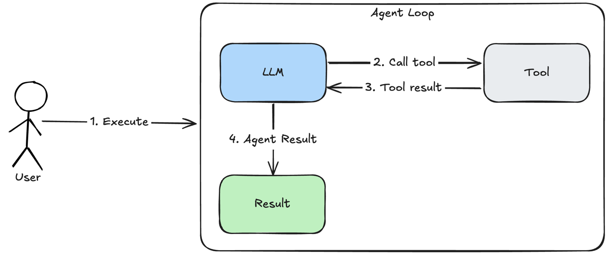
</p>
<p align="center">
  <em>Figure 1: ReAct AI Agent architecture for cybersecurity scanning (Source: Honchar, 2025).</em>
</p>

#### Level 2A — Planner + Executor

A two-node linear pipeline that separates strategy from action: a planner produces a step-by-step plan up front, and an executor carries it out (running a tool-calling loop in interactive domains). Decoupling planning from execution keeps the agent on a global strategy rather than reacting move-by-move.
<p align="center">
  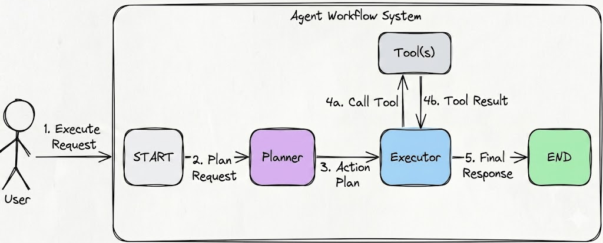
</p>
<p align="center">
  <em>Figure 2: Planner-Executor agent architecture workflow (Generated with Nano Banana 2, June 2026).</em>
</p>

#### Level 2B — Solver + Critic

A cyclic graph that adds a dedicated evaluation node. The solver proposes a solution (a tool-calling loop in interactive domains, a single call otherwise); the critic checks it against the task rules and either accepts it or routes it back to the solver with targeted feedback, up to a fixed revision limit (§3.4). This is iterative self-review: the system refines its own work through a closed feedback loop instead of committing to its first attempt.
<p align="center">
  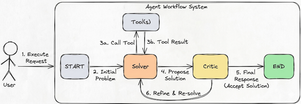
</p>
<p align="center">
  <em>Figure 3: Solver-Critic agent architecture workflow (Generated with Nano Banana 2, June 2026).</em>
</p>

#### Level 3 — Adaptive System

The most complex architecture, extending the solver–critic with Tree-of-Thought (ToT) branching and episodic memory: instead of a single zero-shot attempt, the system explores multiple candidate plans and can reuse what worked on earlier, similar problems. Both mechanisms are detailed below.
<p align="center">
  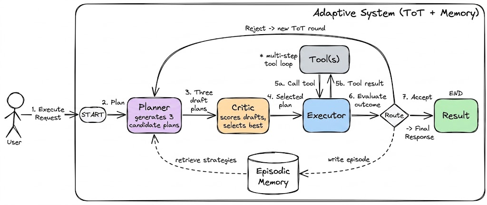
</p>
<p align="center">
  <em>Figure 4: Adaptive system architecture workflow (Generated with Nano Banana 2, June 2026).</em>
</p>

**Tree-of-Thought branching.** The planner is sampled three times on the same prompt, yielding three stochastically distinct candidate plans — a breadth-three expansion, not a deep search tree. One critic pass scores all three (0–1) and commits the best, which the executor then carries out (a single answer in logic, a tool-calling loop in gridworld). A routing step afterwards inspects the best score: if it is below the 0.7 acceptance threshold and the two-iteration cap is not yet reached, control returns to the planner for a fresh round of branches; otherwise the run finalizes.

**Episodic memory.** A memory bank is kept per (domain, difficulty) condition and used only by L3. After every run it stores one episode — a short summary of the committed strategy and whether the critic accepted it — and when planning a later run the planner is shown the two most relevant past episodes (accepted ones first) as hints (§3.5). Two caveats follow. Because the bank fills up as a condition runs and the logic puzzles reuse a small pinned set, a later run can be primed with an earlier run's strategy for the *same* puzzle, so runs within a condition are not fully independent. And because an episode's stored outcome is the critic's own verdict rather than the true score, a wrongly accepted strategy can be cached and re-suggested.

Each stored episode records the domain and difficulty (which scope retrieval), an identifier for the puzzle, the opening of the committed plan, and the critic's verdict. A retrieved hint is pasted above the task tagged `[MEM-N]`; if any of the three sampled plans carries that tag through to its output the run counts as a *reuse hit* — exactly the memory-reuse diagnostic reported for H5.

### 3.2 Domains

We chose two deliberately opposite task types, so that an architecture helping on both can be credited to the architecture rather than the task:

- **Logic puzzles** — the world never changes, the agent sees everything up front, and there are no tools.
- **Gridworld** — the world changes as the agent moves, only part is visible at a time, and it must act step by step.

This contrast answers RQ3 (do advanced architectures still help when the task changes completely?) and motivates H3: a fixed up-front plan should help on the puzzle by preventing reasoning drift, but hurt in the gridworld, where it commits the agent to a plan built around walls it has not yet seen.

#### Domain 1 — Logic puzzles (static deductive reasoning)

The agent is given a set of natural-language clues and must deduce a complete attribute grid: for an $N$-position, $M$-attribute puzzle it must place all $N \times M$ values consistently. There is no environment to act on and no feedback loop — the model reads the clues once and emits a single structured answer, which is then scored cell-by-cell against the ground-truth grid. This isolates pure constraint propagation: the only thing that varies between a correct and an incorrect run is the quality of the reasoning, not the agent's ability to gather information. We draw puzzles from the arg-tech/MysteryZebra benchmark and pin specific puzzle IDs: Pt2_3x3_level3-{0..2} (three 3×3 puzzles) for the easy tier, Pt2_5x5_level3-{0..2} (three 5×5 puzzles) for medium, and the full Pt2_5x5_level3-{0..4} (five 5×5 puzzles) for the hard and extra_hard tiers.

A pinned easy example, Pt2_3x3_level3-0, shows the task concretely:

```
Three foods:        avocado, peach, potato
Three movie-genres: romance, superhero, thriller
Three music-genres: folk, reggae, rock

1. the fan of rock is on the far left or far right
2. the person eating potato is on the far left or far right
3. the fan of folk is the person watching romance movies
4. the fan of reggae is on the left of the person watching superhero movies
5. the person eating peach is between the person watching superhero
   movies and the person eating potato

Ground-truth solution (positions left → right):
  Food        : potato,  peach,    avocado
  Movie-Genre : romance, thriller, superhero
  Music-Genre : folk,    reggae,   rock
```

The agent must return exactly this attribute→position mapping; partial credit is the fraction of the nine cells placed correctly. The 5×5 tier (Pt2_5x5_level3-0) scales the same structure to five positions and five attributes (25 cells) with roughly 19 clues.

#### Domain 2 — Gridworld (dynamic, partially observable interaction)

Gridworld is a custom deterministic engine in which the agent must navigate from a start cell to a goal cell on an $N \times N$ grid containing walls, issuing one movement tool call (`up`/`down`/`left`/`right`) per step. Unlike the puzzles, the agent acts and receives feedback: each move returns a fresh observation, bumping a wall or boundary wastes a step, and the episode ends at the goal or when the step budget is exhausted. At the harder tiers the grid is shrouded in fog-of-war — the agent only observes cells within a radius-1 window of its current position (Figure 5), so it cannot see the walls it must plan around and must build its map incrementally through exploration. Scoring is grounded in the engine state: 1.0 for reaching the goal, otherwise partial credit for distance-reduction toward it.

<p align="center">
  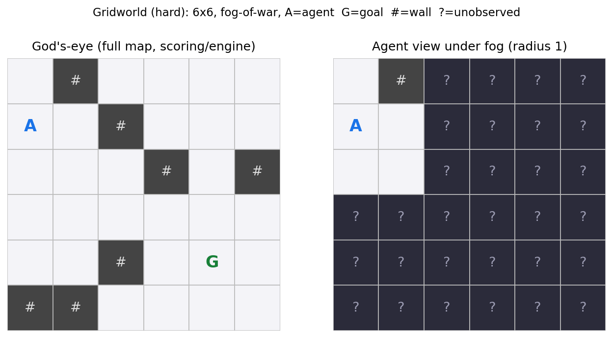
</p>
<p align="center">
  <em>Figure 5: A hard-tier Gridworld instance (6×6, fog-of-war, view radius 1). Left: the god's-eye map used by the engine for scoring. Right: what the agent actually observes from its start cell — only its immediate neighbourhood is revealed (<code>A</code>=agent, <code>G</code>=goal, <code>#</code>=wall, <code>?</code>=unobserved).</em>
</p>

### 3.3 Difficulty ladder and levers

Each domain has its own difficulty ladder, from easy to extra_hard. The labels only order difficulty within a domain; all cross-domain reading is done per-architecture, not per-label:

- **Logic puzzles:** two levers — grid size and thinking-token budget
- **Gridworld:** three levers — grid size, observability (fog-of-war), and token budget

Each rung tightens one lever:

| Level | Logic | Gridworld | Primary lever introduced |
|---|---|---|---|
| easy | 3×3, ∞ budget | 4×4 full-obs, ∞ | grid size baseline |
| medium | 5×5, ∞ | 6×6 full-obs, ∞ | grid size ↑ |
| hard | 5×5, 4000 tok | 6×6 fog, ∞ | logic: token budget / grid: observability |
| extra_hard | 5×5, 1500 tok | 6×6 fog, 500 tok | token budget ↓ |

*Table 2: The difficulty ladder per domain.*

Gridworld additionally shrinks the step budget at every rung (roughly 3× down to 1.5× the shortest possible path), so the agent has less room for wasted moves as difficulty rises.

### 3.4 Model and endpoint configuration

Every run in the study uses the same model, **Qwen3.6-27B** on the ELTE inference endpoint, with the same fixed settings — so that the only things changing across the matrix are the architecture and the difficulty. The locked settings, and the reason each was chosen, are:

| Setting | Value | Why this value |
|---|---|---|
| `reasoning_effort` | `medium` | Middle ground. |
| `temperature` | `0.7` | Standard value. |
| `thinking_token_budget` | per difficulty (see §3.3) | The difficulty lever — caps hidden reasoning per call. |
| `max_tokens` | budget + 2000 (else `65536`) | Leaves room for the JSON answer on top of the reasoning cap. |
| `streaming` | on | Tokens stream continuously so the gateway's idle timeout never fires mid-run. |
| `request_timeout` | `900s` | Under streaming this bounds the gap between tokens, not total runtime. |
| `max_critic_iterations` | `2` | L2B / L3 revision cap. |
| `num_branches` | `3` | L3 Tree-of-Thought width. |

*Table 3: The model and endpoint configuration*

The thinking-token budget and the output cap are different knobs: the former is a Qwen-specific cap on hidden chain-of-thought before the answer is written (the difficulty lever), while the output cap is set 2000 tokens above it so the cap bites reasoning while leaving room for the answer. Unbudgeted tiers (easy/medium) fall back to a ceiling that never binds in practice.

### 3.5 Prompts and the answer contract

Prompting is deliberately layered so that the only thing that changes across the four architectures is the orchestration, not the task framing:

- **Domain layer** (shared): Fixed system prompt and task prompt that state the problem and pin down the answer format
- **Role layer** (per architecture): One short instruction per graph node (planner, solver, critic, executor)

**Domain layer (shared).** In logic, the system prompt casts the model as an expert logic-grid solver and the task prompt supplies numbered rules, case-sensitive attribute keys, a one-line few-shot example, the clues, and a strict JSON contract — making the cell-by-cell scorer (§3.6) unambiguous, so a wrong answer is a reasoning failure, not a formatting accident. In gridworld, the system prompt casts the model as a navigation agent and the task prompt adds start/goal coordinates, step budget, fog notice, and current observation; movement is exposed as four tools (`move_up/down/left/right`), so the domain runs as a genuine tool-calling loop.

**Role layer (per architecture).** Each node appends a short instruction to the domain prompt (verbatim in Appendix B): **L1** adds nothing (bare prompt as a single call / ReAct loop); **L2A** pairs a *planner* that emits a numbered plan with an *executor* that follows it — the plan is frozen before execution, the rigidity §6 argues helps static logic but hurts under fog; **L2B** adds a *solver* fed the full rejection history and a strict *critic* that walks every clue (or the agent's position) and ends with `VERDICT: ACCEPT`/`REJECT`, ambiguous replies defaulting to REJECT; **L3** asks the *planner* for `num_branches = 3` distinct approaches (primed with up to two `[MEM-N]` episodes), a *critic* scores each 0.0–1.0 and commits the best (≥ 0.7), and an executor carries it out.

#### Tool calls and the interactive loop

Logic runs pure text-in/text-out (no tools); gridworld binds the four movement tools, and each executing node (L2A's executor, L2B's solver, L3's executor) runs the standard ReAct cycle: if the model emits a move, the engine applies it and returns a fresh observation, and the loop continues; otherwise control passes to the next node. The model never sees engine internals — it learns state only from the observation string each move returns (including "you bumped into a wall", which still costs a step of the tightening budget). The loop is bounded twice: by the engine's step budget and by a graph-side iteration guard.

**Accounting note:** A tool execution is *not* a model call — the call count records model turns, while environment moves are tracked separately as steps, so reasoning cost and environment interaction stay on distinct axes.

### 3.6 Evaluation metrics

We measure each run on two axes — **capability** and **efficiency** — and every metric is computed by the environment itself.

#### Capability — cell-level score in $[0, 1]$

Both domains produce a graded score rather than a bare pass/fail:

- **Logic puzzles:** the fraction of grid cells placed correctly against the known solution; a run succeeds only when every cell is correct.
- **Gridworld:** `1.0` if the agent reaches the goal, else partial credit for the distance closed, $\max(0, (D_i - D_f) / D_i) \times 0.5$ — capped at `0.5` so not reaching the goal can never out-score reaching it.

**Reporting:** The primary metric is the mean score with a percentile-bootstrap 95% CI (10,000 resamples), used rather than a $t$-interval because cell scores are bounded in $[0,1]$ and often bimodal at tight budgets. To reflect *reasoning quality only*, truncated and infrastructure-error runs are held out of the capability mean (§3.7); parse failures remain in, scored 0. Success rate is a secondary metric.

#### Efficiency — total tokens and model calls

Total tokens is the true compute cost (it bundles hidden reasoning); the call count captures how much an architecture multiplies that cost. Unlike capability, efficiency is measured over all runs including truncated ones — a run that blew its budget still spent it. Runtime is excluded from every conclusion (it varies up to 4× per identical run) and logged only for completeness. Every run is also tagged with one failure mode (§3.7).

### 3.7 Failure-mode taxonomy

Every run is tagged with exactly one label from a six-mode taxonomy:

| Priority | Mode | Triggered when | In capability mean? |
|---|---|---|---|
| 1 | `infra_error` | an exception or endpoint timeout occurred (`error` set) | No |
| 2 | `truncated` | a call was cut off at the token cap (`any_call_truncated`) | No |
| 3 | `parse_failure` | the answer could not be parsed as a valid solution | Yes (scores 0) |
| 4 | `exhausted` | L2B/L3 only: the critic looped to `max_critic_iterations` without converging  | Yes |
| 5 | `reasoning` | a clean, parseable run that was simply wrong (score < 1.0) | Yes |
| 6 | `success` | full score / goal reached | Yes |

*Table 4: The six-mode failure taxonomy*

**Priority order matters:**

- `infra_error` and `truncated` are checked first and held out of the capability mean, because they are infrastructure or budget-margin artifacts rather than failures of reasoning — counting them would confound *the model reasoned badly* with *the harness cut it off*.
- `parse_failure` onward stay in the mean, since failing to emit a readable answer, or emitting a wrong one, is genuinely the architecture's fault.
- Truncation is checked before parse failure: a run cut off at the token cap often also fails to parse, but the root cause is the cap, not the format.


## 4. Experiments

### 4.1 Coverage

All 32 conditions were run to completion; both domains are complete and balanced (Table 5).

| Domain | easy | medium | hard | extra_hard |
|---|---|---|---|---|
| Logic puzzles | 9 | 12 | 30 | 40 |
| Gridworld | 40 | 40 | 40 | 50 |

*Table 5: Run coverage per domain. Logic entries are puzzles × runs-per-puzzle (3×3, 3×4, 5×6, 5×8). Gridworld entries are tasks × runs-per-task (5 x 8 for easy/medium/hard, 5 x 10 for extra_hard).* 

### 4.2 Calibration pilots

Two small pilots set the logic design. The first fixed the puzzle grade (Table 6); the second fixed the budget tiers and tested whether decomposition pays off once the single agent is budget-starved (Table 7).

| Grade | Unlimited | 1500 tokens | Δ |
|---|---|---|---|
| level2 | 1.00 | 0.46 | 0.54 |
| **level3** | **1.00** | **0.72** | **0.28** |
| level4 | 1.00 | 0.10 | 0.90 |

*Table 6: Grade-selection pilot. `level3` is the discrimination zone: an unlimited budget solves perfectly, while a 1500-token budget degrades to partial credit (0.72) without the near-total collapse seen at `level4`. `level2` degrades too close to the floor to separate architectures, so `level3` was chosen.*

In the second pilot (single 5×5 puzzle), sweeping L1 across budgets, scores hovered around 0.5 from 1000–3000 tokens and rose to ~0.83 only at 6000, so **1500 and 4000** were chosen as the constrained and mid tiers. At 1500 tokens both multi-agent architectures outscored L1 (Table 7): L2A's edge is partly inflated by truncation (verbose plan overran the cap on 2 of 5 runs), while L2B was strongest and most consistent, settling within two critic cycles — motivating the cap at 2 for the full sweep.

| Architecture | mean score @ 1500 | truncated |
|---|---|---|
| L1  | 0.50 | 0/5 |
| L2A | 0.72 | 2/5 |
| L2B | 0.85 | 1/5 |

*Table 7: Architecture comparison at the constrained 1500-token budget (single 5×5 puzzle, N = 5 per cell).*

**Gridworld calibration:** A pilot measured a mean peak of ~2420 tokens per call, suggesting ~1500. This was tightened to **500 tokens** once 1500 proved too loose to bind effectively.

### 4.3 Reproducibility

Logic puzzles are pinned by ID and gridworld grids are generated from fixed seeds, so every condition re-runs on identical tasks. The runner is resume-safe, continuing an interrupted sweep without duplicating or corrupting results.


## 5. Results

### 5.1 Capability across the ladder

<p align="center">
  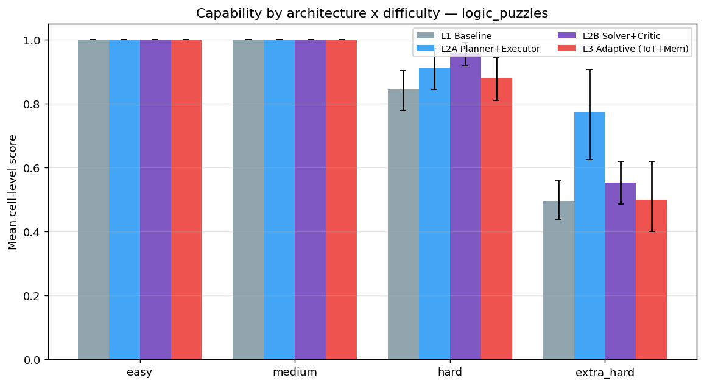
</p>
<p align="center"><em>Figure 6: Logic-puzzle capability (mean cell-level score, bootstrap 95% CI) by architecture across the difficulty ladder.</em></p>

<p align="center">
  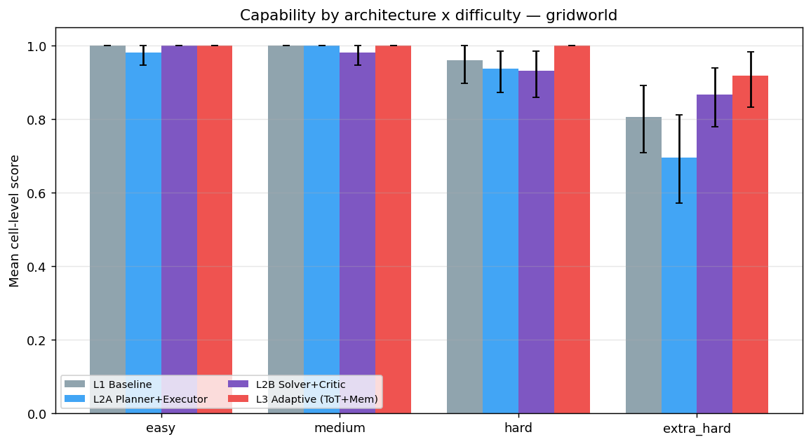
</p>
<p align="center"><em>Figure 7: Gridworld capability (mean cell-level score, bootstrap 95% CI) by architecture across the difficulty ladder.</em></p>

Easy and medium are at the ceiling for every architecture; the full capability and efficiency tables are in Appendix A (Tables 13–16). The two domains separate only at the top of the ladder, and in opposite directions.

**On logic, the planner-first and reflective pipelines pull ahead.** At hard, L2B (0.96) and L2A (0.91) clear L1 (0.84), with L2B's interval entirely above L1's. At extra_hard the spread widens: L2A reaches 0.77 [0.63–0.90] against L1's 0.50, while L2B falls back to 0.55 (tied with the baseline) and L3 tracks L1 (0.50, four runs). The *single planner* (L2A) is the strongest design under the tightest budget; the extra critic-and-branching machinery adds nothing.

**On gridworld the ordering inverts.** L3 alone holds ceiling through hard and stays top at extra_hard (0.92 [0.83–0.98]); the planner-first L2A is the *weakest* there (0.69 [0.57–0.81]), trailing even L1 (0.81), with L2B second (0.87). Easy/medium/hard sit within overlapping intervals, so the separation is confined to extra_hard, where fog and the 500-token budget bite hardest.

### 5.2 Efficiency / cost

<p align="center">
  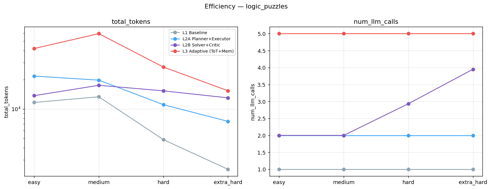
</p>
<p align="center"><em>Figure 8: Logic-puzzle efficiency — mean total tokens (log scale, left) and mean LLM calls (right) by architecture across the ladder.</em></p>

<p align="center">
  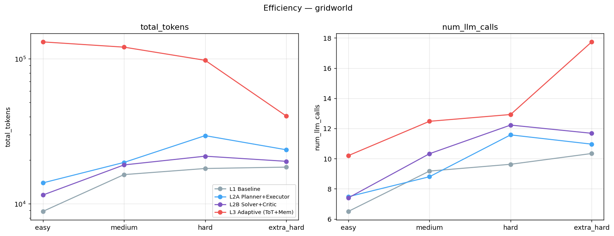
</p>
<p align="center"><em>Figure 9: Gridworld efficiency — mean total tokens (log scale, left) and mean LLM calls (right) by architecture across the ladder.</em></p>


**Cost scales steeply with architecture, and L3 is the most expensive everywhere.** In logic the call count is a clean structural ladder — one model turn for L1, two for L2A, a variable two-to-four for L2B (rising as the critic loops), five for L3 — and tokens follow, L3 spending 1.5–4.5× the baseline. In gridworld the gap is far larger: fanning every run into three planner branches and a critic pass, L3 burns ≈131k tokens per easy run against L1's ≈9k, an order of magnitude more, and stays costliest across the ladder. Gridworld call counts are uniformly higher and noisier for *every* architecture, since the executor's tool-calling loop mixes model turns with environment steps — not directly comparable to the logic column.

One pattern is mechanical: logic L1's tokens *fall* as difficulty rises (11.7k → 2.4k), and L3's drop at hard/extra_hard. This is the thinking-token budget (§3.3) clamping hidden reasoning at the budgeted tiers, not the agents working less — the same clamp collapses gridworld L3 from ≈131k at easy to ≈40k at the 500-token extra_hard tier.

### 5.3 Failure composition

<p align="center">
  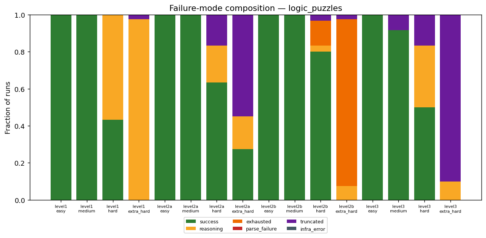
</p>
<p align="center"><em>Figure 10: Logic-puzzle failure-mode composition per (architecture, difficulty), as a fraction of all runs.</em></p>

<p align="center">
  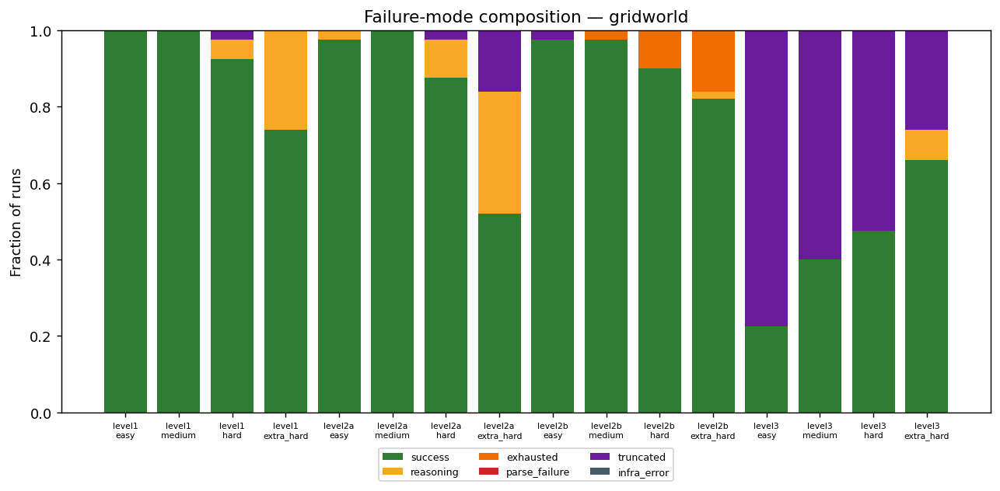
</p>
<p align="center"><em>Figure 11: Gridworld failure-mode composition per (architecture, difficulty), as a fraction of all runs.</em></p>

Each architecture fails the hardest tier in its own characteristic way. The table isolates the extra_hard column, where failures concentrate; §6.1 attributes each mode to its mechanism with sampled runs.

| Architecture | logic extra_hard | gridworld extra_hard |
|---|---|---|
| L1  | 98% reasoning | 26% reasoning |
| L2A | 55% truncated, 18% reasoning | 32% reasoning, 16% truncated |
| L2B | 90% exhausted | 16% exhausted |
| L3  | 90% truncated | 26% truncated |

*Table 8: Dominant failure modes at the extra_hard tier (fraction of runs; remainder are mostly successes).*

The modes line up with the structural cost above: L1 fails clean-but-wrong, L2B by revision exhaustion, L2A and L3 by truncation. L3's truncation (90% of logic extra_hard) is the direct cause of the small eligible-N for its hardest capability cells (§5.1). Parse failures are essentially absent, confirming the strict answer contract (§3.5) held — failures are about reasoning and budget, not formatting. Lower-difficulty columns are dominated by `success` and omitted from the table.


## 6. Analysis

This section takes each hypothesis in turn, reports the verdict plainly — including the two that the data refutes — and ties every number to the architectural mechanism that produces it. The summary verdicts are:

| Hyp | Prediction | Verdict | Key evidence |
|---|---|---|---|
| **H1** | cost rises with complexity; L3 priciest everywhere | **Partially supported** | L3 dominant; L2A↔L2B not strictly monotone (Tables 15–16) |
| **H2** | linear pipelines tight, cyclic ones high-variance | **Supported (clean in logic)** | call-count CV (Table 9) |
| **H3** | planning helps static logic, hurts dynamic gridworld | **Supported** | sign-flip of L2A−L1 advantage (Table 10) |
| **H4** | reflection hurts easy, only L3 survives the hardest tier | **Domain-split** | L3−best-other gap (Table 11) |
| **H5** | memory aids static reasoning, risks negative transfer | **Refuted as stated; descriptive** | reuse diagnostics (Table 12) |

#### H1 — Cost (partially supported)

The strong half holds without qualification: **L3 is the most expensive architecture in every cell of both domains** (Tables 15–16), and the logic call-count ladder is exactly as predicted. The *monotonic* claim fails, though: L2A and L2B swap order. On logic easy/medium L2A spends more than L2B (≈22k vs ≈14k tokens) because its planner always emits a full plan while L2B's critic stays idle on accepted first attempts; the order reverses once the critic loops on harder tiers. So cost rises with complexity in aggregate, but "each added stage strictly multiplies overhead" is too strong — a sometimes-skipped stage (the critic loop) can cost less than one that always runs (the planner).

#### H2 — Dispersion (supported, cleanly in logic)

| Architecture | logic CV (easy → xhard) | gridworld CV (easy → xhard) |
|---|---|---|
| L1  | 0.00 / 0.00 / 0.00 / 0.00 | 0.10 / 0.12 / 0.24 / 0.19 |
| L2A | 0.00 / 0.00 / 0.00 / 0.00 | 0.10 / 0.37 / 0.27 / 0.29 |
| L2B | 0.00 / 0.00 / 0.35 / 0.08 | 0.14 / 0.25 / 0.32 / 0.27 |
| L3  | 0.00 / 0.00 / 0.00 / 0.00 | 0.44 / 0.24 / 0.27 / 0.42 |

*Table 9: Coefficient of variation (std ÷ mean) of LLM calls per run.*

In logic the prediction is textbook: the linear pipelines (L1, L2A) have CV exactly zero — same call count every run — while cyclic L2B jumps to CV = 0.35 at hard, where the critic starts looping. (L2B's CV *falls* at extra_hard only because almost every run loops to the cap — high mean, low spread.) In gridworld the contrast washes out: *every* architecture shows substantial CV, because the executor's tool-calling loop length depends on the trajectory, so even "linear" L2A is not fixed-call. H2 holds where the call count is a pure reasoning signal and is confounded by environment interaction where it is not.

#### H3 — Planning across domains (supported — the headline result)

| Domain | hard | extra_hard |
|---|---|---|
| Logic (planner advantage, L2A − L1) | **+0.07** | **+0.28** |
| Gridworld (planner advantage, L2A − L1) | **−0.02** | **−0.11** |

*Table 10: Planner advantage = mean score of L2A minus L1, at the discriminating tiers. Easy/medium are at ceiling and omitted (advantage ≈ 0).*

The clearest cross-domain finding: the value of an up-front plan **flips sign with the domain and grows with difficulty**. On static logic, committing to a plan helps more as the budget tightens (+0.28 at extra_hard), because the whole problem is visible from the start and a fixed decomposition keeps the model from drifting off a half-finished deduction. In gridworld the same rigidity hurts (−0.11), because under fog the planner writes its plan before the walls are observable, so the executor commits to a route around obstacles it has never seen — one sampled L2A run ends *"the path was blocked by walls at (1,3), (1,4), (1,5), which I could not navigate around."* A plan made before the world is seen breaks on contact, and reactive correction (L1) fares better.

#### H4 — Adaptive structure (domain-split: supported on gridworld, refuted on logic)

| Domain | easy | medium | hard | extra_hard |
|---|---|---|---|---|
| Gridworld (L3 − best simpler) | 0.00 | 0.00 | **+0.04** | **+0.05** |
| Logic (L3 − best simpler) | 0.00 | 0.00 | **−0.08** | **−0.27**¹ |

*Table 11: Gap between L3 and the best non-L3 architecture's mean, per tier. ¹Logic extra_hard L3 rests on 4 eligible runs.*

H4 predicted reflection and branching would be dead weight at easy difficulty and the *only* thing surviving the hardest tier. The first half holds everywhere — L3 never beats the simpler systems at easy/medium. The second half splits by domain. **On gridworld H4 holds:** L3 is the single best architecture at hard and extra_hard (gap +0.04, +0.05), the one design staying near ceiling under fog and the 500-token budget, because re-planning across branches lets it recover when a branch walks into a wall. **On logic H4 is refuted:** the simple planner L2A beats L3 at hard (−0.08) and extra_hard (−0.27). On a fully-observable puzzle there is nothing to adapt *to*, so the extra branches mostly burn the scarce budget — L3's dominant logic failure is truncation (§5.3). Added structure pays off only when the environment supplies genuine uncertainty for it to respond to.

#### H5 — Memory (refuted as stated; reported descriptively)

| Domain | branches/run | retrievals/run | reuse hits/run |
|---|---|---|---|
| Logic (easy → xhard) | 3.0 | 1.7–1.9 | 0.00–0.12 |
| Gridworld (easy → xhard) | 3.0 | 1.9 | 0.44–1.23 |

*Table 12: L3 Tree-of-Thought / memory diagnostics, averaged per condition.*

H5 expected memory to help the *static* logic domain (where the pinned puzzle set recurs) and to risk negative transfer in the *interactive* one. The diagnostics point the opposite way: retrieval fires everywhere (≈2 episodes/run), but retrieved hints survive into the chosen plan far more in gridworld (0.4–1.2 reuse hits/run) than in logic (≈0) — the planner leans on past episodes precisely where H5 expected it to ignore them. As stated, H5 is not supported. We stop at description rather than claiming an effect: whether reuse *helps* or merely *happens* cannot be separated without the memory-free ablation this design lacks (§6.2). That ablation is named as future work.

### 6.1 Failure analysis

Each failure mode is the fingerprint of a specific architectural choice; the sampled answers (logic extra_hard unless noted) make the attribution concrete.

**L1 — reasoning failure (runs out of competence, not budget).** A fully-formed, well-typed but mis-deduced grid, e.g. scoring 0.68 in a single untruncated call. With one forward pass and no correction stage, the agent has no recourse once a deduction goes wrong.

**L2A — truncation (the verbose-plan tax).** The plan itself overruns the token margin: one sampled run was clipped even though its partial answer was on track to a perfect score. Writing a full plan on top of the solution blows the `budget + 2000` ceiling — a direct consequence of decoupling planning from execution.

**L2B — exhaustion (the critic that cannot converge).** Revision exhaustion at the tightest tier (90% of runs): the critic, never seeing ground truth, keeps rejecting an answer it cannot verify and loops to the cap — one sampled run made four calls across two revisions and still scored 0.60. The feedback loop that helps at `hard` becomes a stall once the budget is too small to fix anything.

**L3 — truncation from over-branching (cost without head-room).** Three candidate plans plus a critic pass consume the budget before a single answer finishes, clipping 90% of logic extra_hard runs. The machinery that wins under gridworld's uncertainty is pure overhead on a static puzzle, and it is why L3's hardest logic scores rest on so few eligible runs.

### 6.2 Threats to validity

- **Single model and endpoint.** All results are from one model (Qwen3.6-27B) on one endpoint, so we claim relative comparisons within this setup, not absolute generality.
- **Difficulty levers differ across domains.** The two ladders tighten different knobs, so same-label cross-domain score comparisons are invalid; all cross-domain claims are about *patterns* (does the planner advantage flip sign?), never matched scores.
- **The critic never sees ground truth.** L2B/L3 self-review against the task rules, not the solution, so a critic can reject a correct answer or accept a wrong one — visible as L2B's exhaustion stalls and memory caching self-judged "successes" (H5).
- **Wide intervals at the hardest tiers.** With 8–10 runs per cell, several discriminating cells carry wide CIs, and L3 truncation leaves some (logic L3 extra_hard, n = 4) on a handful of eligible runs — read as indicative, not measured.
- **Memory effect not causally isolated.** With no memory-free ablation, a live-accumulating bank (so within-condition runs are not independent), and episodes keyed on the critic's verdict rather than truth, H5 is descriptive only.
- **Runtime excluded.** Shared-endpoint load swung wall-clock time up to ≈4× for identical token counts, so cost is measured in tokens and calls, not runtime.


## 7. Conclusion

Across four architectures, four difficulty tiers, and two domains, added complexity earns its token cost only when the task supplies genuine uncertainty, and only at the discriminating tiers. At easy/medium every architecture saturates, so the extra machinery is pure overhead — and never cheap, with L3 costing from 1.5× the baseline in logic to an order of magnitude more in gridworld. The verdict is conditional, not monotone: complexity buys nothing at low difficulty, helps decisively on the dynamic domain at the top of the ladder (L3 alone holds near ceiling under fog and a 500-token budget), and is counter-productive on the static domain, where the simple planner is most capable and the branching architecture starves itself of the budget needed to finish one good deduction.

The central cross-domain lesson (RQ3) is that **structure which helps static reasoning can hurt dynamic interaction.** The up-front plan was our most robust result: it helps more as the logic budget tightens (+0.28 at extra_hard) yet hurts under fog (−0.11), because a plan written before the world is observed commits the agent to routes around walls it has never seen. This is why no single architecture "won": the right amount of structure is a property of the task, not the agent.

The more interesting of the two refuted predictions concerns memory: we expected it to pay off on the repetitive static puzzles, but retrieved strategies are reused far more in gridworld than in logic. We report this descriptively, since the design cannot separate whether reuse *helps* or merely *happens* without the memory-free ablation it lacks (§6.2). That ablation is the first item of future work, alongside a second model to test generality and more runs to tighten the hardest-tier intervals. Agentic structure is a tool with a cost, and our clearest contribution is a map of where that cost is repaid and where it is wasted.


## Appendices

### Appendix A — Coverage and eligible-run counts

Section 4.1 gives the total runs per cell; every one of the 32 conditions is complete. The capability mean, however, is taken only over capability-eligible runs (truncated and infrastructure-error runs excluded, §3.6). The table below gives that **eligible** count per cell — the denominator behind each capability score — which makes the small-N caveats in §5–§6 explicit.

| Architecture | easy | medium | hard | extra_hard |
|---|---|---|---|---|
| L1  | 1.00 | 1.00 | 0.84 [0.78–0.90] | 0.50 [0.44–0.56] |
| L2A | 1.00 | 1.00 | 0.91 [0.85–0.97] | 0.77 [0.63–0.90] |
| L2B | 1.00 | 1.00 | **0.96 [0.92–0.99]** | 0.55 [0.49–0.62] |
| L3  | 1.00 | 1.00 | 0.88 [0.81–0.94] | 0.50 [0.40–0.62]¹ |

*Table 13: Logic-puzzle capability. ¹L3 extra_hard rests on only 4 eligible runs (90% truncated, §5.3); treat it as indicative, not measured.*

| Architecture | easy | medium | hard | extra_hard |
|---|---|---|---|---|
| L1  | 1.00 | 1.00 | 0.96 [0.90–1.00] | 0.81 [0.71–0.90] |
| L2A | 0.98 [0.95–1.00] | 1.00 | 0.94 [0.87–0.99] | 0.69 [0.57–0.81] |
| L2B | 1.00 | 0.98 [0.95–1.00] | 0.93 [0.86–0.99] | 0.87 [0.78–0.94] |
| L3  | 1.00 | 1.00 | **1.00 [1.00–1.00]** | **0.92 [0.83–0.98]** |

*Table 14: Gridworld capability. L3 easy–hard cells are backed by 9–19 eligible runs (the rest truncated, §5.3).* 

| Architecture | logic easy / med / hard / xhard | gridworld easy / med / hard / xhard |
|---|---|---|
| L1  | 11.7k / 13.4k / 4.8k / 2.4k | 8.9k / 15.9k / 17.5k / 17.9k |
| L2A | 21.8k / 19.8k / 11.1k / 7.5k | 13.9k / 19.3k / 29.5k / 23.6k |
| L2B | 13.7k / 17.5k / 15.4k / 13.0k | 11.5k / 18.6k / 21.3k / 19.6k |
| L3  | 41.9k / 59.5k / 27.0k / 15.4k | 130.9k / 120.5k / 97.7k / 40.3k |

*Table 15: Mean total tokens per run (the true compute cost; includes hidden reasoning).*

| Architecture | logic easy / med / hard / xhard | gridworld easy / med / hard / xhard |
|---|---|---|
| L1  | 1 / 1 / 1 / 1 | 6.5 / 9.2 / 9.6 / 10.3 |
| L2A | 2 / 2 / 2 / 2 | 7.5 / 8.8 / 11.6 / 11.0 |
| L2B | 2 / 2 / 2.9 / 4.0 | 7.4 / 10.3 / 12.2 / 11.7 |
| L3  | 5 / 5 / 5 / 5 | 10.2 / 12.5 / 12.9 / 17.7 |

*Table 16: Mean LLM calls per run (model turns; in gridworld these include the tool-calling loop, so they also reflect environment steps).*

| Architecture | logic e / m / h / xhard | gridworld e / m / h / xhard |
|---|---|---|
| L1  | 9 / 12 / 30 / 39 | 40 / 40 / 39 / 50 |
| L2A | 9 / 12 / 25 / 18 | 40 / 40 / 39 / 42 |
| L2B | 9 / 12 / 29 / 39 | 39 / 40 / 40 / 50 |
| L3  | 9 / 11 / 25 / **4** | **9 / 16 / 19** / 37 |

*Table 17: Capability-eligible runs per cell. Bold cells are the truncation-thinned L3 conditions flagged throughout §5–§6 (logic L3 extra_hard, n = 4; gridworld L3 easy–hard).*

### Appendix B — Prompt templates (verbatim)

Prompting is layered: a shared **domain layer** (system + task, identical across all four architectures) plus a per-architecture **role layer** (§3.5). Holding the domain layer fixed is what attributes a score difference to topology rather than wording.

**Domain layer — logic puzzles.**

```
[system] You are an expert at solving logic grid puzzles. Use only the given
clues to infer the full grid assignment. Return the final solution in strict
JSON format.

[task]   <description>
         Rules: <numbered rules>
         Attribute keys (case-sensitive): "<key1>", "<key2>", ...
         Use these keys exactly in the JSON output.
         <one-line few-shot example>
         Clues: <clues>
         Output format:
         {"attribute": ["value_at_position_1", "value_at_position_2", ...]}
```

**Domain layer — gridworld.**

```
[system] You are a navigation agent in a 2D grid world. Your goal is to reach
the target position by calling movement tools. Analyze the grid observation
carefully before each move. Avoid walls (#) and grid boundaries. Plan an
efficient path and execute it step by step.

[task]   <description>
         Rules: <rules>
         Current observation: <fogged or full grid>
         Navigate to the goal using the movement tools. After reaching the
         goal, respond with DONE.
```

**Role layer — per architecture.**

```
L1  (baseline)   no role prompt; the bare domain layer is run as a single call
                 (a ReAct tool loop in gridworld).

L2A planner      You are a strategic planner. Analyze the task and create a
                 detailed step-by-step plan. Be specific about each action.
                 Output ONLY the plan, numbered step by step.
L2A executor     You are a precise executor. Follow the plan provided and solve
                 the task. Return only the final answer in the required format.
                 Do not restate the plan or the task.

L2B solver       the domain layer plus, on each rejection, the full rejection
                 history ("Attempt N was rejected: … address every point and
                 produce a corrected solution").
L2B critic       You are a meticulous critic. Your job is to rigorously verify a
                 proposed solution against the task's rules. You do not solve the
                 task yourself — you judge correctness and give actionable
                 feedback. Be strict: only accept a solution that fully satisfies
                 every rule.  [+ a per-clue verification prompt ending in
                 VERDICT: ACCEPT / VERDICT: REJECT; ambiguous replies → REJECT]

L3  planner      You are a strategic planner. Analyze the task and generate
                 multiple distinct solution approaches. Each approach should be
                 detailed and specific. Output your plan in a structured format
                 ready for execution.  [primed with up to two retrieved memory
                 episodes tagged [MEM-N]]
L3  critic       You are a meticulous critic. … judge correctness and score each
                 solution. Be strict: only high scores for solutions that fully
                 satisfy every rule.  [scores each branch 0.0–1.0; best ≥ 0.7 is
                 committed]
L3  executor     You are a precise executor. Follow the plan provided and solve
                 the task. Return only the final answer in the required format.
                 Do not restate the plan or the task.
```


### References

[1] Yao, S., Zhao, J., Yu, D., Du, N., Shafran, I., Narasimhan, K., & Cao, Y. (2023). "ReAct: Synergizing Reasoning and Acting in Language Models." *Proceedings of the 11th International Conference on Learning Representations (ICLR)*. [https://arxiv.org/abs/2210.03629](https://arxiv.org/abs/2210.03629)  
[2] "Plan-Then-Execute Pattern," *Agentic Patterns Architecture Guide*. [https://www.agentic-patterns.com/patterns/plan-then-execute-pattern/](https://www.agentic-patterns.com/patterns/plan-then-execute-pattern/)  
[3] "Understanding the Plan and Execute AI Agent Framework," *JumpCloud IT Index*. [https://jumpcloud.com/it-index/understanding-the-plan-and-execute-ai-agent-framework](https://jumpcloud.com/it-index/understanding-the-plan-and-execute-ai-agent-framework)  
[4] "Reflection Agents," *LangChain Blog*. [https://www.langchain.com/blog/reflection-agents](https://www.langchain.com/blog/reflection-agents)  
[5] "When AIs Start Talking: Multi-Agent Systems Explained Simply," *Sagacify Resources*. [https://sagacify.com/resource/when-ais-start-talking-multi-agent-systems-explained-simply/](https://sagacify.com/resource/when-ais-start-talking-multi-agent-systems-explained-simply/)  
[6] Yao, J., Yu, D., Zhao, J., Shafran, I., Griffiths, T., Cao, Y., & Narasimhan, K. (2023). "Tree of Thoughts: Deliberate Problem Solving with Large Language Models." *Proceedings of the Neural Information Processing Systems (NeurIPS)*. [https://proceedings.neurips.cc/paper_files/paper/2023/file/271db9922b8d1f4dd7aaef84ed5ac703-Paper-Conference.pdf](https://proceedings.neurips.cc/paper_files/paper/2023/file/271db9922b8d1f4dd7aaef84ed5ac703-Paper-Conference.pdf)  
[7] "Tree of Thoughts Implementation Guide," *Hugging Face Blog*. [https://huggingface.co/blog/sadhaklal/tree-of-thoughts](https://huggingface.co/blog/sadhaklal/tree-of-thoughts)  
[8] "Long-Term Cognitive Dynamics in Autonomous Agents," *Preprints*, 202601.0618. [https://www.preprints.org/manuscript/202601.0618](https://www.preprints.org/manuscript/202601.0618)  
[9] Park, J. S., O'Brien, J. C., Cai, C. J., Morris, M. R., Liang, P., & Bernstein, M. S. (2023). "Generative Agents: Interactive Simulacra of Human Behavior." *arXiv preprint arXiv:2304.03442*. [https://arxiv.org/pdf/2304.03442](https://arxiv.org/pdf/2304.03442)  
[10] "Architectural Frameworks for Episodic Memory in LLM Subsystems," *arXiv preprint arXiv:2501.13956*. [https://arxiv.org/pdf/2501.13956](https://arxiv.org/pdf/2501.13956)  
[11] "Episodic Memory Retrieval and Injection Patterns," *Agentic Patterns Architecture Guide*. [https://www.agentic-patterns.com/patterns/episodic-memory-retrieval-injection/](https://www.agentic-patterns.com/patterns/episodic-memory-retrieval-injection/)  
[12] "Multi-Agent Orchestration vs. Single Model Deployments in Cybersecurity Benchmarks," *MindStudio Analytics*. [https://www.mindstudio.ai/blog/multi-agent-orchestration-vs-single-model-cybersecurity](https://www.mindstudio.ai/blog/multi-agent-orchestration-vs-single-model-cybersecurity)  
[13] "Scaling Multi-Agent Orchestration: Evaluating 8B Model Ensembles Against 32B Baselines," *arXiv preprint arXiv:2601.11327v2*. [https://arxiv.org/html/2601.11327v2](https://arxiv.org/html/2601.11327v2)  
[14] "Hybrid Ensembles of Small Language Models (SLMs) for Automated Malware Analysis," *Proceedings of the Research in Attacks, Intrusions, and Defenses (RAID) Conference*, 2026. [https://adelsamir.com/assets/pdf/raid_2026.pdf](https://adelsamir.com/assets/pdf/raid_2026.pdf)  
[15] Wang, X., Wei, J., Schuurmans, D., Le, Q., Chi, E., Narang, S., Chowdhery, A., & Zhou, D. (2024). "Self-Consistency Improves Chain of Thought Reasoning in Language Models." *arXiv preprint arXiv:2402.05120*. [https://arxiv.org/pdf/2402.05120](https://arxiv.org/pdf/2402.05120)  
[16] "Engineering Trade-offs: Single-Agent vs. Multi-Agent AI Architectures," *Augment Code Developer Guides*. [https://www.augmentcode.com/guides/single-agent-vs-multi-agent-ai](https://www.augmentcode.com/guides/single-agent-vs-multi-agent-ai)  
[17] "Budget-Normalized Evaluations of Thinking Tokens in Multi-Agent Reasoning Systems," *arXiv preprint arXiv:2604.02460*. [https://arxiv.org/pdf/2604.02460](https://arxiv.org/pdf/2604.02460)  
[18] "Context Retention and KV Cache Efficiency in Unified Agent Trajectories," *OpenReview Submission*. [https://openreview.net/pdf?id=i95lcR2GN5](https://openreview.net/pdf?id=i95lcR2GN5)  
[19] "Context Degradation Limits and Context Handoff Latency in Complex Tasks," *Proceedings of the 2026 EACL Student Research Workshop*. [https://aclanthology.org/2026.eacl-srw.4.pdf](https://aclanthology.org/2026.eacl-srw.4.pdf)  
[20] Zheng, L., Chiang, W. L., Sheng, Y., Zhuang, S., Wu, Z., Zhuang, Y., Barrett, J., Zou, J., Gonzalez, J. E., Stoica, I., & Frick, M. (2023). "Judging LLM-as-a-Judge with MT-Bench and Chatbot Arena." *arXiv preprint arXiv:2306.05685*. [https://arxiv.org/abs/2306.05685](https://arxiv.org/abs/2306.05685)  
[21] "On the Limitations of Language Models as Judges for Real-World Environments," *arXiv preprint arXiv:2401.10020*. [https://arxiv.org/abs/2401.10020](https://arxiv.org/abs/2401.10020)